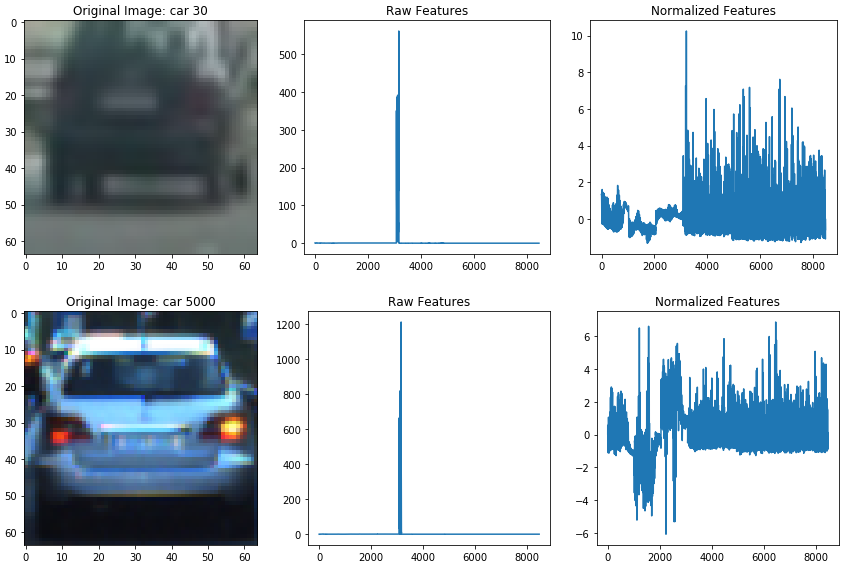
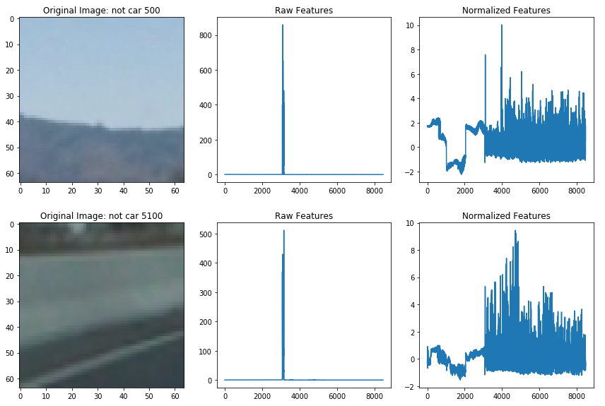

# Vehicle Detection Project

## Introduction

The goal of the project was to write software pipeline to identify vehicles in a video from a front-facing camera on a car. To detect vehicles, at first, we had to use an approach which was very popular in computer vision 10+ years ago and includes two common steps: feature extraction and prediction based on trained Linear SVM classifier.

The goals steps of this project are the following:
* a Histogram of Oriented Gradients (HOG) feature extraction on a labeled training set of images and train a Linear SVM classifier. 
* a color transform and binned color features, as well as histograms of color, to combine the HOG feature vector with other common computer vision approaches.
* a sliding-window technique combined with trained SVM classifier to search for vehicles in images.
* creating a heat map of recurring detections in subsequent frames of a video stream to reject outliers and follow detected vehicles.
* estimation of bounding box for vehicles detected.

The developed pipeline was used to draw bounding boxes around detected vehicels in the video.

[//]: # (Image References)
[image1]: ./images/cars_not_cars1.png
[image2]: ./images/hog_features_YCrCb.png
[image3]: ./images/scales.png
[image4]: ./images/detection_1.png
[image5]: ./images/detection_2.png


# Getting Started
* Clone the project and create directories `vehicles` and `non-vehicles`. 
* Download images from the links given below (see Data Exploration) and put them into subfolders below `vehicles` and `non-vehicles`. 
* use `explore_data.ipynb` to look at the samples in data set, used for training Linear SVM classifier.
* `train_hog_classifier.py` or `train_hog_classifier.ipynb` trains the Liniear SVM classifier to detect cars and non-cars. The classifier data is saved in a pickle file, `HOGClassifier.p` by default.
* `find_cars.py` implements a sliding-window technique to search for vehicles with including false positive filtering in the video.
* `video_vehicle_detection.py` and `video_vehicle_detection.ipynb` are equals and implement video pipline to identify vehicles in a video.

## Please see the [rubric](https://review.udacity.com/#!/rubrics/513/view) points

---
# Data Exploration

The labeled vehicle and non-vehicle images with the size 64x64 pixels were taken from the [GTI](http://www.gti.ssr.upm.es/data/Vehicle_database.html) vehicle image database and from the [KITTI](http://www.cvlibs.net/datasets/kitti/) vision benchmark suite. A third [data set](https://github.com/udacity/self-driving-car/tree/master/annotations) from Udacity was not used here.

The total combination of data sets contains 8792 vehicle images and 8968 non-vehicle images. The data set is slightly 2% unbalanced - more non vehicle images than vehicle images. The images of [GTI](http://www.gti.ssr.upm.es/data/Vehicle_database.html) data set are taken from video sequences. The [KITTI](http://www.cvlibs.net/datasets/kitti/) data set contains the same vehicle appear more than once, but typically under significantly different lighting/angle from other instances. Here is an example of the vehicle and non-vehicle classes:

![car not-car sample][image1]


# Histogram of Oriented Gradients (HOG)

##  HOG feature extraction, color and spatial features.

#### 1 Feature extraction

The most of code used for feature extraction is contained in [`hog_util_functions.py`](hog_util_functions.py).
The extraction of features from vehicle and non-vehicle images of data set is implemented in `extract_features()` function in [`train_hog_classifier.py`](train_hog_classifier.py) file.

The feature descriptor used for training the classifier is implemented as a combination of three features: HOG feature, color feature and spatial feature, computed from images of size 64x64 pixels. All parameters which define how these
features are calculated is specified as in `params` dictionary structure in `__main__` section of [`train_hog_classifier.py`](train_hog_classifier.py) file.

For the task of vehicle detection I used feature vector as combination of HOG features to encode the shape of objects and color histograms and spatial features to encode the object visual appearence. While it is easy to understand and implement the first two color and spacial features, the HOG features can be a little bit trickier to master.

#### 2 Choosing feature parameters

*Histogram of Oriented Gradients* or HOG descriptors started widely use in 2005 when Navneet Dalal and Bill Triggs, researchers for the French National Institute for Research in Computer Science and Automation (INRIA), presented their supplementary work [Histograms of Oriented Gradients for Human Detection](http://lear.inrialpes.fr/people/triggs/pubs/Dalal-cvpr05.pdf) at the Conference on Computer Vision and Pattern Recognition (CVPR). Below you can see four samples of HOG descriptors, claculated for two car patches and two non-car patches in YCrCB color space (ch0 is Y channel, ch1 and ch2 are Cr and Cb color channels respectively).
![car not-car sample][image2]

The disadvantage of HOG descriptors is that it needs to use a lot of parameters to tune them in order to work properly.
The most common parameters are: size of the cell in which the gradients are accumulated, the number of orientations used to discretize the histogram of gradient orientations, the size of blocks used for contrast normalization of local responses, different block normalization schemes. More over, for the case of vehicle detection, it needs to understand what color space is preferable for solving classification problem, which channels to use for HOG descriptors.

In order to select the right parameters, I used both the classifier accuracy and computational efficiency on tested video. After many experiments I concluded to the following parameters, which can be found in `params` dictionary structure in `__main__` section of [`train_hog_classifier.py`](train_hog_classifier.py) file:
```
    # Parameters used during feature extraction
    params = {}
    params['color_space'] = 'YCrCb'   # Can be RGB, HSV, LUV, HLS, YUV, YCrCb
    params['orient'] = 9              # HOG orientations
    params['pix_per_cell'] = 8        # HOG pixels per cell
    params['cell_per_block'] = 2      # HOG cells per block
    params['hog_channel'] = 'ALL'     # Can be 0, 1, 2, or "ALL"
    params['spatial_size'] = (16, 16) # Spatial binning dimensions
    params['hist_bins'] = 16          # Number of histogram bins
    params['spatial_feat'] = True     # Spatial features on or off
    params['hist_feat'] = True        # Histogram features on or off
    params['hog_feat'] = True         # HOG features on or off
```

<p align="center">
  <br>Two examples of feature desctriptors calculated for Car samples.
  
</p>

<p align="center">
  <br>Two examples of feature desctriptors calculated for Non-Car samples.
  
</p>

#### 3. Training the classifier

Once we decided which features to use, we can train a classifier on computed features. In the [`train_hog_classifier.py`](train_hog_classifier.py) file I train linear SVM for task of binary classification car vs non-car. The same code can be found in the [`train_hog_classifier.ipynb`](train_hog_classifier.ipynb) file, which is more usefull for tuning and testing approach with some visualization. 

First, cars and non-cars data sets are computed as a list of feature descriptors for car and non-car path images respectively:
```
    cars_feats = extract_features(cars, params)
    notcars_feats = extract_features(notcars, params)
```

Then, the computed data sets are combined into single data set `X` with feature normalization. The labels vector for combined data set is computed too:
```
    X = np.vstack((cars_feats, notcars_feats)).astype(np.float64)
    X_scaler = StandardScaler().fit(X)
    scaled_X = X_scaler.transform(X)
    y = np.hstack((np.ones(len(cars)), np.zeros(len(notcars))))
```

Then, the collected data set is randomized and train-test splited on 80% training set and 20% test set. After that, the Linear SVM classifier is trained as:
```
    svc = LinearSVC()
    svc.fit(X_train, y_train)
```

In order to estimate the classifier performance, the prediction on the test set is cimputed via `svc.score(X_test, y_test)`

## Sliding Window Search

#### 1. Describe how (and identify where in your code) you implemented a sliding window search.  How did you decide what scales to search and how much to overlap windows?

I implemented a sliding window approach in order to get windows at different scales for purpose of vehicle detection. The sliding window search is implemented in function `find_cars_multiscale()` in [`find_cars.py`](find_cars.py) file.
To decrease the computation time, I utlimately implemented a function that's able to both extract features and make predictions as suggested by the course instructor. The advantage of this approach is that HOG features are computed only once for the whole region of interest and then can be sub-sampled to get all of its overlaying windows. Its possible to run this same function multiple times for different scale values to generate multiple-scaled search windows. This function is called `find_cars` and implemented in [`find_cars.py`](find_cars.py). I used 4 different scales for 4 different zones with 75% overlapping windows as a compromise between performance and detection accuracy. All these scales are presented in the file [`vehicle_detection.ipynb`](vehicle_detection.ipynb) which was used to tuning the sliding window serach parameters too. The window sizes are 51, 83, ,120 and 70 pixels for each zone, see below.

#### Scales from left to right, top to bottom: 0.8 (51x51), 1.3 (83x83), 1.8 (115x115), 2.3 (147x147)
![scales][image3]

#### 2. Show some examples of test images to demonstrate how your pipeline is working.  What did you do to optimize the performance of your classifier?

The whole classification pipeline with using CV approach is implemented in [`video_vehicle_detection.py`](video_vehicle_detection.py). The file [`video_vehicle_detection.ipynb`](video_vehicle_detection.ipynb) contains the same pipeline code and was used for parameter tuning. Each test image undergoes through the process_pipeline function, which is responsbile for all phases: feature extraction, classification and showing the results.

#### Result of HOG pipeline on several test images.
![false posiitives][image4]

In order to optimize the performance of the classifier, I trained the classifier with different configuration of parameters and kept the best. To select optimized set of scales and zones for hot windows, I performed detection at different scales in different zones. As a result of these experiments, I got the pipeline as a tradeoff the decreased the  computation time (0.7-0.5 sec per frame) vs detection accuracy.

## Video Implementation

#### 1. Provide a link to your final video output.  Your pipeline should perform reasonably well on the entire project video (somewhat wobbly or unstable bounding boxes are ok as long as you are identifying the vehicles most of the time with minimal false positives.)
An example of applying the pipeline to a video can be found [here](./output_images/processed_project_video.mp4)

#### 2. Describe how (and identify where in your code) you implemented some kind of filter for false positives and some method for combining overlapping bounding boxes.

False positive filtering by a heatmap. In order to filter false positives, I implemented a FIFO queue (see class `BoundingBoxes` in [`find_cars.py`](find_cars.py)) used to store the bounding boxes of the last `N` frames. The FIFO queue allows to implement a heatmap with averaging the detection results along subsequence of frames. The heatmap is generated from bounding boxes, saved in the FIFO queue, and then thresholded to identify positions of vehicles, so the major part of false positive is removed. This process is visualised in realtime in the thumbnails at the top of processed frames.

#### Below you can see result of false positive filtering by a heatmap.
![false posiitives][image5]


## Discussion

#### 1. Briefly discuss any problems / issues you faced in your implementation of this project.  Where will your pipeline likely fail?  What could you do to make it more robust?

The result of HOG+SVM approach depends on the large set of parameters used as for feature extraction. The second disadvantage is fixed and limited set of features used for classification problem. If the selected paramets are optimal for trained/tested sequences of video, there is no any garanty that the HOG+SVM pipeline will be robust for different conditions.

As a next step to get more robust vehicle detection pipeline, I'm going to use Deep Learning approach: SSD, YOLO and SqueezeDet. 

### Acknowledgments


```python

```


```python

```
